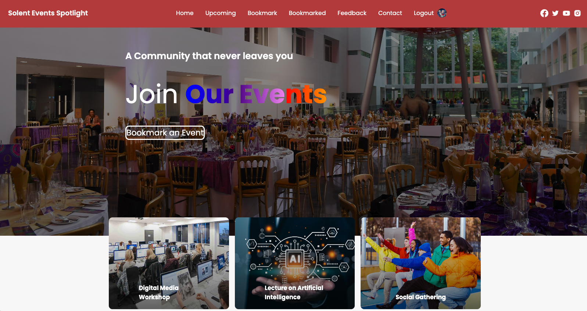

# Solent Events Spotlight
### University Students Event Spotlight Web Application

## Table of Contents
- [Introduction]
- [Adaptive-Design]
- [Visual-Enhancements]
- [Feedback-Mechanism]
- [Features]
- [Technologies]
- [User-Centric-Interactivity]
- [Starting-Application]
- [Usage]
- [Contributions]

## Introduction
The Solent University Student Event Spotlight Web Application is a responsive single-page web application (SPA) designed to highlight and promote various events happening within Solent University. Recognizing the vibrant campus life and the plethora of events, this project aims to provide students with a centralized platform to discover, track, and participate in these events. This README provides a comprehensive overview of the app's purpose, features, technologies, and setup instructions.

## Adaptive Design
  - **Multi-Device Support**: The Solent University Student Event Spotlight Web Application is designed to be accessible and functional across a variety of devices, from desktops to tablets and smartphones.
  - **Responsive Layout**: The application dynamically adjusts its layout based on the device's screen size, ensuring an optimal viewing and interaction experience.
  - **Mobile-First Approach**: With a significant number of users accessing the platform on mobile devices, the application has been crafted with a mobile-first design approach, ensuring seamless navigation and functionality on smartphones.

## Visual Enhancements
- **Styled Animations**: The Solent University Student Event Spotlight Web Application boasts smooth and engaging animations, enhancing user interactions and providing a dynamic user experience.
  - **CSS Visual Effects**: Leveraging the power of CSS, the application incorporates visually appealing effects, transitions, and transformations that elevate the overall aesthetic and user interface.
  - **Interactive Elements**: Elements within the application respond intuitively to user actions, offering feedback through subtle animations and effects, ensuring a more immersive user journey.

## Feedback Mechanism
- **User Feedback Submission**: The Solent University Student Event Spotlight Web Application values user feedback as a cornerstone for continuous improvement. Users can effortlessly submit their feedback, suggestions, or concerns directly through the platform with a star rating system to.
  - **Firestore Integration**: All feedback submissions are securely stored in the Firestore database, ensuring data integrity and easy retrieval.
  - **Admin Oversight**: Admins have exclusive access to view all feedback entries. This allows them to monitor, update, or take into consideration any user suggestions, ensuring that the platform evolves in line with user needs and expectations.

## Features
- **User Registration and Authentication**
  - **Multiple Registration Methods**: Users can register either using their email and password by creating an account on the application or conveniently by clicking the Google logo provided in the Login Form, accessing the app through their Google account, offering flexibility in the sign-up process.
  - **Event Discovery and Tracking**: Students can explore a wide array of events, from academic seminars to cultural festivals, and track their participation or interest, can bookmark or unbookmark events, can see upcoming events or what they booked and many more.
   

## Technologies
The Solent University Student Event Spotlight Web Application harnesses the power of modern technologies to deliver a seamless and efficient user experience:

- React.js: The frontend is crafted using React.js, ensuring a dynamic and interactive user interface.
- CSS: Tailored styling guarantees a visually appealing and intuitive design.
- JavaScript: The app employs JavaScript for enhanced interactivity and fluid user experiences.
- Firebase: Firebase is employed for user authentication and secure data storage, prioritizing user privacy and data safety.
- HTML: The app's foundational structure is sculpted using HTML, ensuring consistency and universal accessibility.

## User-Centric Interactivity
- **Dynamic Menu Display**: The Solent University Student Event Spotlight Web Application intelligently adapts its menu options based on the user's authentication status. Logged-in users are presented with a comprehensive menu tailored to their membership, while guests or unauthenticated users see a limited set of options.
  - **Member-Exclusive Access**: Certain features and sections of the application are reserved exclusively for members. Non-members can't access these areas, ensuring the platform's security and exclusivity.
  - **Interactive Feedback**: The application is designed to provide real-time feedback to users. Every interactive button, when clicked, triggers informative pop-up messages. These messages could be confirmations, informational notes, or error alerts, ensuring users are always informed about the results of their actions.

## Starting-Application
To dive into the Solent University Student Event Spotlight Web Application, adhere to these straightforward steps:

1. Clone this Repository: Initiate by cloning this repository to your local machine with the command:
git clone (https://github.com/Palanciuc/solent-events-spotlight.git)

2. Install Dependencies: Transition to the project's root directory and install the required dependencies via npm:
- npm install

3. Run the Application: Activate the application on a local server using:
- npm start

4. Explore: Launch your favorite web browser and navigate to `http://localhost:3000`. Delve into the vibrant world of Solent University events.

## Contributions
Contributions to refine the Solent University Student Event Spotlight Web Application are greatly appreciated. If you wish to contribute, please adhere to the following steps:

- Fork the Repository: Initially, fork this repository to your GitHub profile.
- Create a New Branch: Design a new branch for your feature or bug fix, ensuring it has a descriptive title.
- Implement Changes: Modify the codebase, ensuring you follow best coding practices and standards.
- Commit and Push: Commit your alterations with clear commit messages and push them to your forked repository.
- Submit a Pull Request: Propose a pull request from your branch to the main repository, detailing the rationale and specifics of your contribution.